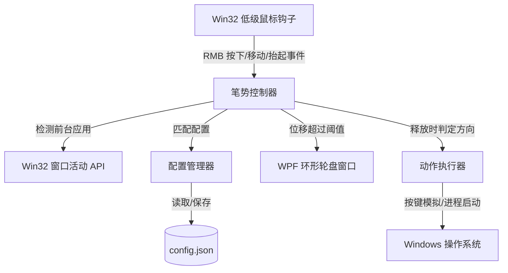

# 产品需求文档 (PRD)：Windows 全局轮盘鼠标笔势工具 (WinPieGestures)

## 1. 业务摘要 (Executive Summary)

- **问题陈述**：Windows 用户缺乏一种高效、全局、且具备软件感知能力的快捷操作触发器。现有的键盘快捷键需要多键组合，且需要用户移开握持鼠标的手。而 SolidWorks 等专业 CAD 软件的“鼠标笔势”因其极高的肌肉记忆响应速度备受好评，但无法直接应用于其他桌面应用。
- **解决方案**：开发一款基于 C# (.NET 8 + WPF) 的轻量级 Windows 桌面实用程序。它通过注册低级全局鼠标钩子监听右键拖拽行为。当用户按住鼠标右键并向特定方向拖拽超过设定阈值时，在光标处瞬间弹出一个可配置的 4/8/12 方向的环形（轮盘）菜单。松开右键即可触发预设动作（启动软件、模拟快捷键组合、执行系统控制），且这些动作会根据当前处于活动状态的软件窗口（应用感知）自动切换。
- **成功指标**：
  - **轮盘 UI 弹出延迟**：拖拽位移超过阈值后，轮盘菜单必须在 **50毫秒** 内渲染完成并显示在屏幕上。
  - **资源占用**：后台静默监听时，CPU 占用率必须 **低于 0.5%**（以主流 Intel Core i5/AMD Ryzen 5 或同等配置为基准），内存占用 **低于 50MB**。
  - **识别准确率**：方向判定与角度计算的可靠性必须达到 **99.9%** 以上。
  - **原生右键穿透**：如果用户仅是标准右击操作（未发生拖拽或位移低于阈值），点击事件必须流畅穿透，原生右键菜单触发延迟必须 **低于 10毫秒**。

---

## 2. 用户体验与功能模块 (User Experience & Functionality)

### 用户画像 (User Personas)
- **专业开发者与效率狂人**：频繁在编辑器、浏览器、命令行等多个应用之间切换，希望在不移开鼠标的情况下快速触发常用命令。
- **设计师与音视频剪辑师**：使用 Photoshop、Premiere、Blender 等软件，需要根据不同应用快速调用不同的快捷工具轮盘。

### 用户故事与验收标准 (User Stories & Acceptance Criteria)

#### 故事 1：全局笔势识别与轮盘 UI
> **作为一个用户，我希望能够通过按住右键并向某一方向划动来看到一个直观的轮盘菜单。**
- **验收标准**：
  - 当按住右键移动位移超过阈值（默认 20 像素）时，立即以初始按下位置为圆心显示轮盘菜单。
  - 轮盘菜单必须支持配置不同的槽位数量：**4键**（90° 扇区）、**8键**（45° 扇区）或 **12键**（30° 扇区）。
  - 当光标划向某个扇区时，对应的扇区应有平滑的颜色高亮视觉反馈。
  - 当在某个高亮扇区内松开右键时，触发对应的槽位动作，同时销毁轮盘窗口。
  - 如果用户将鼠标划回圆心或在未跨越阈值前松开，轮盘消失，不触发任何操作，且不呼出系统的右键菜单。

#### 故事 2：应用感知配置 (Context-Aware)
> **作为一个用户，我希望轮盘绑定的动作能根据我当前使用的软件自动切换，以便在不同场景下都有最契合的快捷操作。**
- **验收标准**：
  - 软件能实时识别当前前台活动窗口的进程名称（例如 `chrome.exe`, `devenv.exe`, `explorer.exe`）。
  - 如果用户为当前进程配置了专属轮盘，则加载该应用的专属配置。
  - 如果没有匹配的专属配置，则自动加载“全局默认 (Global Default)”轮盘。
  - 应用状态检测与配置切换必须无感，切换开销 **小于 10毫秒**。

#### 故事 3：动作类型支持
> **作为一个用户，我希望每个槽位能执行各种不同类型的动作，比如运行程序、按键宏、调节音量等。**
- **验收标准**：
  - **启动动作**：能够启动指定的可执行程序、打开指定文件夹或网址（例如：启动 Chrome、打开工作区、访问目标网址）。
  - **模拟快捷键**：通过 Windows 系统输入模拟器，稳定触发组合键（如 `Ctrl+C`, `Ctrl+V`, `Win+D` 或自定义宏指令）。
  - **系统控制**：支持预设的常用系统操作：
    - 一键静音 / 取消静音
    - 调节音量（单次增/减 2%）
    - 快速截图（唤起系统截图工具或直接将当前屏幕/活动窗口截图存入剪贴板）
    - 锁定计算机 (`Win+L`)

#### 故事 4：极简表格配置界面
> **作为一个用户，我希望有一个简单的设置界面来管理轮盘动作，而不是去手动编辑 JSON 或 XML 文件。**
- **验收标准**：
  - 提供一个清爽直观的设置窗口，无需复杂的拖拽，初期采用**列表/表格**形式展示。
  - 左侧展示已配置的“应用配置文件列表”（支持添加进程过滤）。
  - 右侧根据选择的 4/8/12 键布局，以列表行展示各个方向（如“上方”、“右上方”等）的绑定规则。
  - 支持下拉选择动作类型（启动、快捷键、系统），并配有参数输入框与单行“测试”按钮。
  - 配置数据以持久化 JSON 格式保存在 `%localappdata%/WinPieGestures/config.json` 中。

### 非本期目标 (Non-Goals)
- 本期暂不实现全图形化拖拽式轮盘编辑器（规划在 v1.1 迭代）。
- 不支持多指触控板手势或手写笔压感输入（专注于鼠标精准笔势）。
- 暂不包含基于云服务的配置跨设备同步。

---

## 3. AI 系统要求
*本软件为本地轻量级系统工具，不涉及 AI 模型调用。*

---

## 4. 技术规范 (Technical Specifications)

### 架构概述
本应用主要由以下四个模块组成：

1. **Win32 钩子引擎**：使用 `WH_MOUSE_LL` 低级鼠标钩子拦截并处理全局鼠标输入。当右键按下时，拦截事件并启动拖拽检测；在松开前评估是否转为笔势。
2. **笔势控制器**：计算轨迹向量 $(X_t - X_0, Y_t - Y_0)$ 的模长 $D$ 和夹角 $\theta$，以此判定激活的扇区索引。
3. **轮盘 UI**：基于 WPF 构建的无边框、无焦点、置顶透明窗口。利用 `DrawingVisual` 或 WPF 矢量路径渲染圆环切片，结合 HSL 配色方案提供微动画高亮。
4. **动作执行器**：通过 Win32 的 `SendInput` 提供低级键盘仿真，使用 `.NET` 的 `Process.Start` 启动进程，以及调用系统的核心音频核心 API。

### 安全与隐私
- **纯本地运行**：本软件不收集、不上传任何键盘输入、鼠标轨迹或应用使用习惯数据。
- **钩子范围限制**：鼠标钩子仅在右键按下后工作，触发完成后即刻释放监听流；键盘模拟仅在执行快捷键的瞬间触发，不进行任何常态化键盘监听。

---

## 5. 风险评估与路线图 (Risks & Roadmap)

### 阶段性路线图
- **阶段 1 (MVP 最简可行产品)**：
  - 完成低级鼠标钩子底座，确保右击动作的无延迟 pass-through。
  - 完成透明 WPF 轮盘 UI，支持 4/8/12 键矢量图切片显示与扇区高亮。
  - 支持 JSON 配置文件的自动读取，完成基础的动作执行器（程序启动与标准热键模拟）。
- **阶段 2 (v1.0 稳定版)**：
  - 引入应用感知功能，使轮盘能随当前窗口软件实时更新。
  - 提供基于 WPF 的表格配置面板，实现无需编辑配置文件的 GUI 配置。
  - 补全系统控制（音量、截图、锁屏）等底层集成。
- **阶段 3 (v1.1 体验提升版)**：
  - 引入可视化轮盘拖拽配置界面。
  - 支持复杂的多按键宏录制。

### 核心技术风险
- **右键原生菜单冲突**：全局拦截右键可能导致部分浏览器或 CAD 软件在单击右键时菜单无法弹出或响应变迟钝。
  - *规避方案*：只有当拖拽位移大于 20px 时才将右击包丢弃（即拦截）。若时间极短且无位移，则在 `WM_RBUTTONUP` 中采用 `mouse_event` API 瞬时重放“按下-抬起”事件，确保原有菜单能正常激活。
- **管理员权限沙箱**：当当前活动窗口处于管理员权限运行（如“任务管理器”或管理员命令行）时，普通权限的用户程序注册的鼠标钩子和 `SendInput` 将失效。
  - *规规方案*：在程序启动时检测权限，如果用户需要在开发/管理应用上触发笔势，提供并在界面提示其“以管理员身份运行”本程序。
