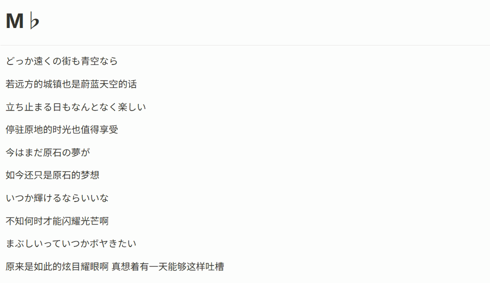
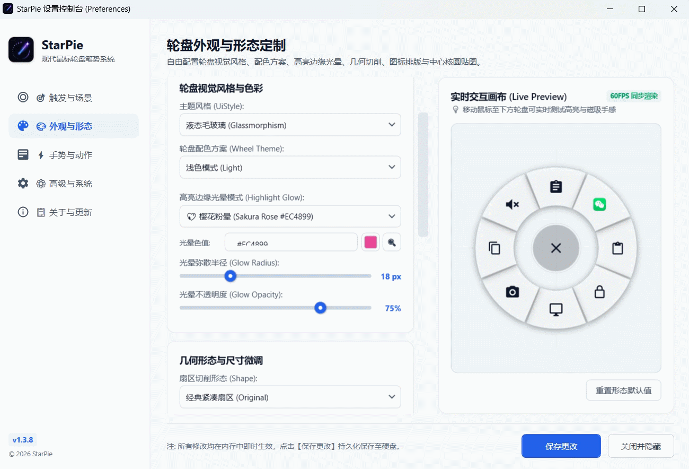
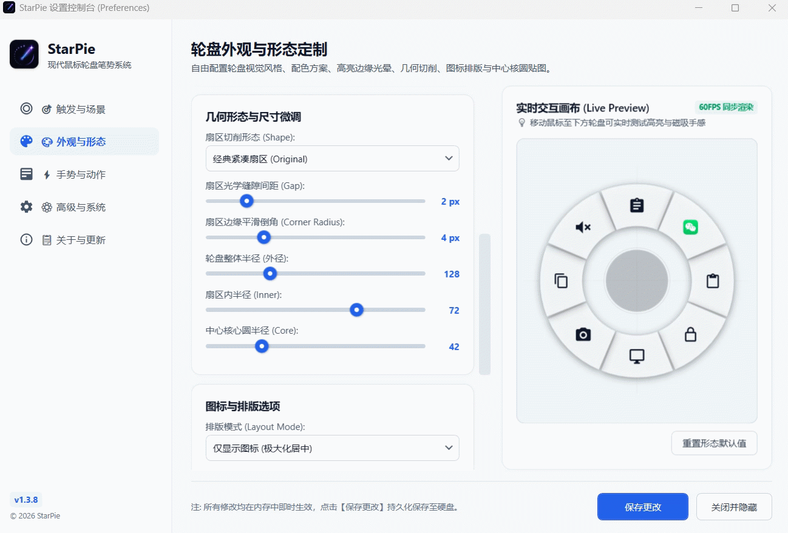
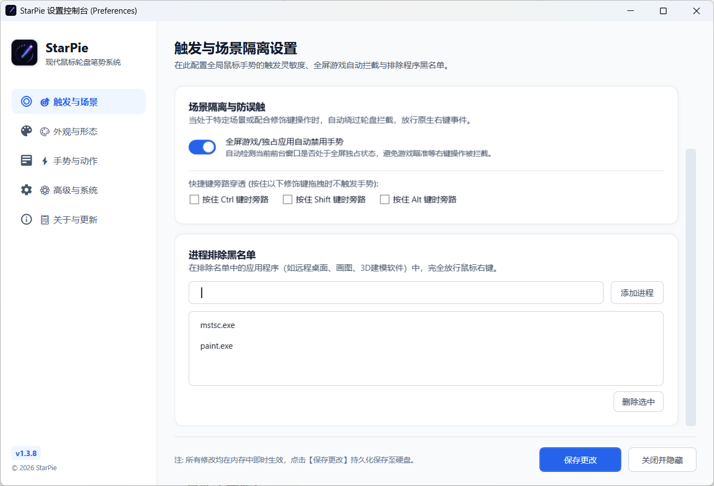
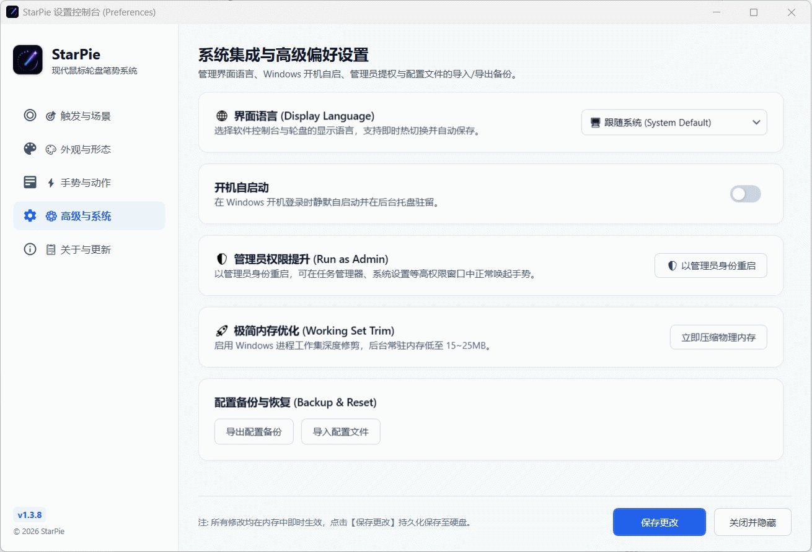

<div align="center">


# StarPie (星盘)

### 极简 · 轻量 · 极速 现代化 Windows 鼠标轮盘笔势系统
**Ultra-Lightweight, Blazing-Fast & Elegant Radial Pie Menu for Windows 10 / 11**

[](https://github.com/SoftBlack42/StarPie/releases)
[-0078D4.svg?style=flat-square&logo=windows)](https://microsoft.com/windows)
[](https://dotnet.microsoft.com/)
[](LICENSE)
[](tests/)
[](#i18n)
[](#acknowledgements)

<br/>

**[简体中文](README.md)** • **[English](README_EN.md)**

<br/>

[🚀 快速开始](#download) • [✨ 核心特性](#features) • [🎨 视觉定制](#visuals) • [🌐 多语言](#i18n) • [🛠️ 开发者指南](#build) • [💡 开发致谢](#acknowledgements) • [📋 更新日志](CHANGELOG.md)

</div>

---

## <a id="intro"></a>📖 简介 (Introduction)

**StarPie (星盘)** 是一款专为 Windows 10 / 11 打造的**极致轻量、超低开销、毫秒级响应、高颜值**现代鼠标轮盘手势（Radial / Pie Menu）生产力工具。

在任意桌面或应用程序中，只需**按住鼠标右键轻轻滑动**，即可在光标所在位置瞬间呼出 60FPS 丝滑液态轮盘。配合 4/8/12 方位动作映射、多程序专属配置（Per-App Profiles）、快捷键录制、程序极速启动与全光谱发光特效，将重复冗长的操作化为指尖瞬时的肌肉记忆。

> 🪶 **极致轻量无负担 (Ultra-Lightweight)**：
> - **🍃 3 ～ 5 MB 极低内存常驻**：原生 C# WPF 构建，无 Electron 臃肿内核，内置工作集内存优化引擎，常驻后台近乎零占用；
> - **⚡ < 2ms 毫秒级极速响应**：基于 Win32 `WH_MOUSE_LL` 底层事件流，轻量无感，告别输入延迟；
> - **🟢 0 依赖免安装单文件**：提供独立单文件版（`StarPie.exe`），内置 .NET 8 运行时，双击即开即用，无需配置任何外部依赖！

---

## <a id="features"></a>✨ 核心功能亮点 (Key Features)

### 1. 🪶 极致轻量架构与 3 ～ 5MB 内存守护
- **拒绝臃肿**：采用高性能原生 C# 与底层 Win32 API 打造，彻底告别基于 Chromium/Electron 带来的数百兆内存与资源消耗；
- **智能内存修剪**：轮盘窗口收起后自动调度工作集压缩回收，后台常驻内存仅 **3 ～ 5 MB**，轻薄本与老旧设备也能全天候丝滑无感常驻；
- **绿色便携**：所有配置采用本地 `config.json` 存储，无流氓服务与后台驻留守护进程，解压即用，随拷随走。

---

### 2. ⚡ 毫秒级极速唤醒与低级鼠标钩子
- 基于 Windows Win32 `WH_MOUSE_LL` 低级鼠标钩子，输入捕获延迟低于 **2ms**；
- 自动心跳巡检与自愈恢复机制，杜绝钩子被系统异常释放导致的偶发失效；
- 智能区分普通右键单击与划动笔势，完全不影响原生右键菜单正常弹出。

<div align="center">
  
  <br/>
  
</div>

---

### <a id="visuals"></a>3. 🎨 4 大几何形态与 7 套精美预设主题
- **4 大几何形态**：
  - **经典紧凑扇区 (Original)**：经典紧凑，手感稳定；
  - **独立悬浮圆形 (Circle)**：灵动悬浮，视野通透；
  - **圆角胶囊 (Capsule)**：现代极简，胶囊切角；
  - **蜂巢六边形 (HexagonHive)**：硬朗科幻，机械机甲感。
- **丰富配色与实时画布**：
  - 内置 **极简纯白**、**极夜曜黑**、**液态毛玻璃 (Glassmorphism)**、**暗夜紫罗兰**、**抹茶森林**、**冰川透蓝**、**萌宠猫爪** 等主题；
  - 配备 **60FPS 实时动态交互画布**，支持 16 进制颜色任意微调、屏幕吸色与自定义配色方案持久化增删管理。

<div align="center">
  
</div>

---

### 4. 🌈 8 种高亮边缘发光光晕 (Highlight Glow)
- **多光谱发光特效**：
  - 支持 **丁香晶紫**、**冰川湛蓝**、**翡翠荧绿**、**樱花粉晕**、**琥珀金光**、**珊瑚赤光**、**冰魄纯白** 等预设光晕；
  - 支持全调色盘自定义颜色与屏幕吸色；
  - 发光弥散半径（8 ～ 48px）与不透明度（0% ～ 100%）自由平滑微调。

<div align="center">
  
</div>

---

### 5. 🖼️ 中心核圆图案与本地图片贴图 (Core Pattern & Custom Image)
- **多样矢量图案**：内置十字准心、Windows 徽标、靶心圆点、快捷主页、电源开关、罗盘、萌宠猫爪等矢量图案；
- **自定义本地贴图**：支持一键导入任意本地图片（PNG/JPG/WebP/ICO/GIF）作为中心核圆专属图案，并支持独立显示开关与尺寸自适应。

<div align="center">
  
</div>

---

### 6. 🎯 4 / 8 / 12 键多向方位自适应 (Dynamic Sector Adaptation)
- **4 键十字方位 (Cross 4)**：上下左右大角度盲操，误触率为 0；
- **8 键全向方位 (Standard 8)**：经典 8 向均衡布局（默认推荐）；
- **12 键钟表方位 (Clock 12)**：高密度功能映射，适合重度生产力用户。

<div align="center">
  
</div>

---

### 7. 💼 多程序专属方案与智能检索高清图标 (Per-App Profiles & Scanner)
- **多程序专属方案自动匹配**：
  - 为 Chrome、VS Code、Photoshop、Word、CAD 等不同软件自动匹配专属轮盘与动作快捷键；
- **全新智能应用程序检索**：
  - 全面整合开始菜单、桌面、用户级 `AppData\Local\Programs`、`WindowsApps` 与注册表 8 大源头；
  - 强效过滤已卸载残留死链（Ghost Items）、卸载向导与内部辅助进程；
  - 自动提取并缓存软件纯净高清图标，支持搜索框实时模糊过滤。

<div align="center">
  
</div>

---

### 8. 🛡️ 场景隔离与全屏游戏防误触 (Gaming & Blacklist Isolation)
- **全屏与游戏智能放行**：
  - 智能检测全屏独占应用与 3D 游戏，自动放行原生右键；
- **修饰键与黑名单穿透**：
  - 支持 Ctrl / Shift / Alt 修饰键直通穿透；
  - 支持一键将当前前台进程加入黑名单排除。

<div align="center">
  
</div>

---

### 9. 🌐 四国多语言即时热切换 (Multi-Language i18n)
- 原生内置 **简体中文 (zh-CN)**、**繁體中文 (zh-TW)**、**English (en)**、**日本語 (ja)** 与 **跟随系统 (System Default)** 五种语言模式；
- 在设置页切换即时热刷新，免重启立即生效。

<div align="center">
  
</div>

---

## <a id="download"></a>🚀 快速开始 / 下载 (Quick Start & Download)

### 最新正式版：`v1.4.0`

| 版本类型 | 适用人群 | 文件说明 | 下载入口 |
| :--- | :--- | :--- | :--- |
| 🟢 **独立免安装单文件版 (推荐)** | **所有用户** | 内置 .NET 8 运行时，零依赖双击即用 | [⬇️ 下载 StarPie.exe (Standalone)](https://github.com/SoftBlack42/StarPie/releases) |
| ⚡ **极简轻量便携版** | 已安装 .NET 8 运行时的用户 | 体积仅数 MB，绿色免安装便携目录 | [⬇️ 下载 StarPie 极简便携包](https://github.com/SoftBlack42/StarPie/releases) |
| 🏷️ **历史版本归档** | 开发者与历史版本追溯 | 包含各版本历史编译产物与源码镜像 | [📂 浏览 Releases 归档目录](https://github.com/SoftBlack42/StarPie/releases) |

### 基础使用方式：
1. 双击运行 `StarPie.exe`，应用自动在系统托盘驻留运行；
2. **按住鼠标右键**并向任意方向轻推，即可呼出手势轮盘；
3. 滑动至目标扇区后**松开鼠标右键**，即可瞬间执行预设动作；
4. 双击系统托盘图标或右键点击「偏好设置」，即可打开图形化控制台进行个性化配置。

---

## <a id="i18n"></a>🌐 多语言国际化 (Internationalization)

StarPie 控制台与轮盘界面支持多国语言，并在「⚙️ 高级与系统 (Advanced & System)」中提供即时热切换选项：

| 语言代码 | 显示名称 | 状态 |
| :--- | :--- | :---: |
| `zh-CN` | 🇨🇳 简体中文 (Simplified Chinese) | 🟢 完整支持 |
| `zh-TW` | 🇭🇰/🇹🇼 繁體中文 (Traditional Chinese) | 🟢 完整支持 |
| `en` | 🇺🇸 English (US/UK) | 🟢 完整支持 |
| `ja` | 🇯🇵 日本語 (Japanese) | 🟢 完整支持 |
| `Auto` | 🖥️ 跟随操作系统语言 (System Default) | 🟢 完整支持 |

---

## <a id="build"></a>🛠️ 本地构建与开发 (Development & Build)

### 环境依赖
- Windows 10 / 11 (x64)
- [.NET 8.0 SDK](https://dotnet.microsoft.com/download/dotnet/8.0) (v8.0.100 或更高版本)
- Python 3.10+ (仅运行自动化测试需要，`pytest`, `pywinauto`)

### 编译与运行
```bash
# 1. 克隆代码仓库
git clone https://github.com/SoftBlack42/StarPie.git
cd StarPie

# 2. 编译项目 (Release)
dotnet build WinPieGestures/WinPieGestures.csproj -c Release

# 3. 运行应用程序
dotnet run --project WinPieGestures/WinPieGestures.csproj
```

### 打包发布产物
```bash
# 生成独立免安装单文件版 (Zero-Dependency Self-Contained)
dotnet publish WinPieGestures/WinPieGestures.csproj -c Release -r win-x64 --self-contained true -p:PublishSingleFile=true -p:IncludeNativeLibrariesForSelfExtract=true -o releases/v1.4.0/StarPie-v1.4.0-Standalone-win-x64

# 生成轻量框架依赖版 (Framework-Dependent)
dotnet publish WinPieGestures/WinPieGestures.csproj -c Release -r win-x64 --self-contained false -o releases/v1.4.0/StarPie-v1.4.0-Lightweight
```

### 运行自动化测试 (16/16 Passed 🟢)
```bash
# 安装测试依赖
pip install pytest pywinauto

# 执行全量 16 项端到端 GUI 自动化测试
python -m pytest tests/test_settings.py -v
```

---

## <a id="structure"></a>📂 项目结构 (Project Structure)

```
StarPie/
├── .github/                   # GitHub Actions CI 流水线与社区规范
├── WinPieGestures/            # StarPie 核心源码工程 (WPF / C# .NET 8)
│   ├── ActionExecutor.cs      # 热键模拟、程序启动、系统命令执行引擎
│   ├── MouseHook.cs           # 低级鼠标全局钩子与健康巡检
│   ├── GestureController.cs   # 笔势轨迹跟踪、角度判定与状态机
│   ├── StyleRendererFactory.cs# 多形态渲染器工厂
│   ├── I18n.cs                # 集中式四国语言国际化字典
│   ├── ConfigManager.cs       # 配置存储、跨会话记忆与热重载
│   ├── MemoryOptimizer.cs     # 内存压缩优化器
│   ├── ProgramPickerWindow.xaml# 智能应用选择器 (死链过滤与高召回率)
│   ├── SettingsWindow.xaml    # 5 维度现代图形化设置控制台
│   ├── RadialWindow.xaml      # 60FPS 实时轮盘透明交互窗口
│   └── app_icon.ico           # 高清 Squircle 嵌入式图标
├── releases/                  # 各版本发布包与归档镜像
│   └── v1.4.0/                # v1.4.0 独立单文件与轻量版二进制
├── attachments/               # 官方动图演练与截图资源
├── tests/                     # 基于 pywinauto 的端到端自动化测试套件
│   ├── conftest.py            # 沙箱隔离与进程生命周期管理
│   └── test_settings.py       # 16 项集成与界面测试用例
├── CHANGELOG.md               # 完整版本演进与更新日志
├── CONTRIBUTING.md            # 社区贡献指南
├── SECURITY.md                # 安全策略与漏洞反馈
├── LICENSE                    # MIT 开源许可证
└── README.md                  # 项目说明主文档
```

---

## <a id="acknowledgements"></a>💡 开发故事、致谢与维护声明 (Story, Acknowledgements & Maintenance)

### 🌟 灵感来源与开发者手记 (Inspiration & Developer Story)
本人是机械设计制造及其自动化专业的一名学生，日常经常使用 SolidWorks 进行三维建模画图，觉得软件自带的鼠标手势轮盘非常顺手好用。

在接触到 AI Agent 这类强大的工具后，萌生了将这种轮盘操作迁移到 Windows 桌面全局的想法，希望能以此提升日常操作的效率和舒适度。对于部分此前未接触过手势轮盘的朋友来说，这或许是一种新奇的交互体验，能把这种体验做出来带给大家，让我感到由衷的开心。

虽然 GitHub 上已经有同类型的轮盘项目，但在具体的功能细节与使用习惯上还是有些细分方向的区别。从最初动工到如今发布，中途因学业课程与竞赛有所耽搁，断断续续与 AI 进行人机协作、历时大概一周做出了现在的版本。

虽然目前功能可能还稍显单调，部分细节也仍有些粗糙，但这确实是我实打实投入心血做出来的成果。每一次新功能的实现、Bug 的修复、性能与内存的优化、UI 界面的提升，都让我感受到了纯粹的喜悦。

项目不够完善的地方还请大家多包涵。如果你在日常使用中发现了问题，或有新的功能建议，欢迎随时向我提交 Bug 报告、提出 Issue 建议，或是提交 Pull Request！后续如果还有空闲时间和精力，我依然会尽力去完善和维护它。

### 🤖 人机协同工程实践 (Co-Authored with AI Agent)
本项目由开发者主导架构设计、产品交互原型与核心系统调优，并与先进 AI 编程智能体（**AI Agent - Antigravity**）深度协作完成：
- **研发范式**：全流程践行**规格驱动开发 (SDD)** 与 **测试驱动开发 (TDD)**，通过 16 项端到端 GUI 自动化测试实现严苛的质量保障；
- **分工边界**：由人类开发者把控 Windows 交互直觉、Win32 钩子安全边界与多语言术语，AI Agent 协同加速模块化代码构建、多版本重构与极限场景回归测试。

### 📌 阶段性维护说明 (Maintenance Notice)
- **当前状态**：StarPie v1.4.0 核心功能已完整实现并经过真机全面验证（**Feature-Complete & Production-Ready**），可直接作为生产力日常主力工具使用；
- **后续规划**：近期开发者因**学业深造与求职事务**，版本迭代节奏将转为阶段性维护模式。欢迎社区伙伴提交 Issue 与 Pull Request 共同完善！

---

## <a id="contributing"></a>🤝 参与贡献 (Contributing)

欢迎任何形式的贡献！无论是提交 Bug 报告、提出新功能建议，还是提交 Pull Request。详情请参阅 [CONTRIBUTING.md](CONTRIBUTING.md)。

1. Fork 本仓库；
2. 新建特性分支 (`git checkout -b feature/AmazingFeature`)；
3. 提交修改 (`git commit -m 'feat: Add some AmazingFeature'`)；
4. 推送至分支 (`git push origin feature/AmazingFeature`)；
5. 开启 Pull Request。

---

## <a id="license"></a>📄 开源许可证 (License)

本项目基于 [MIT License](LICENSE) 开源。
