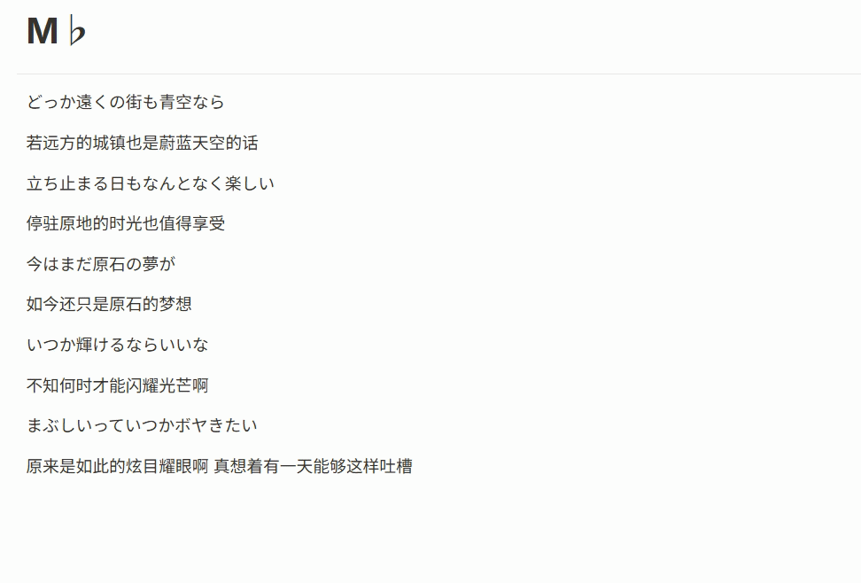
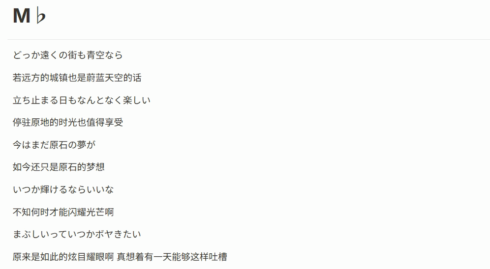
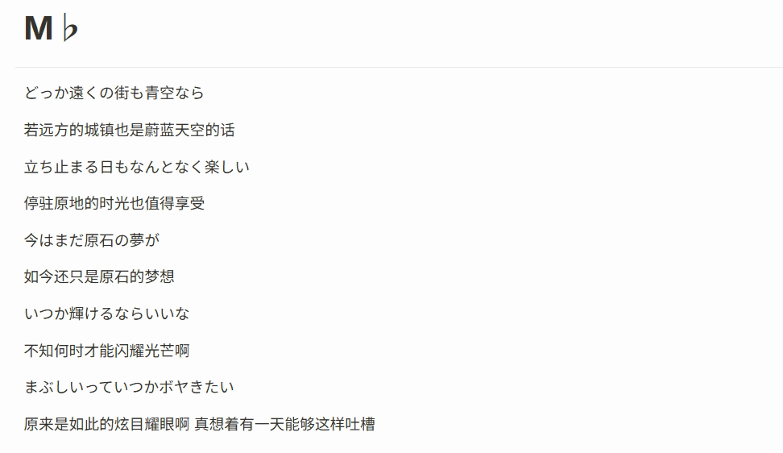
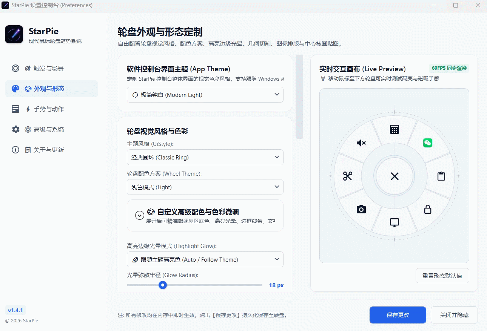
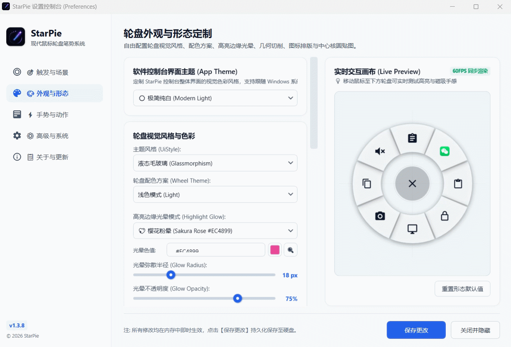
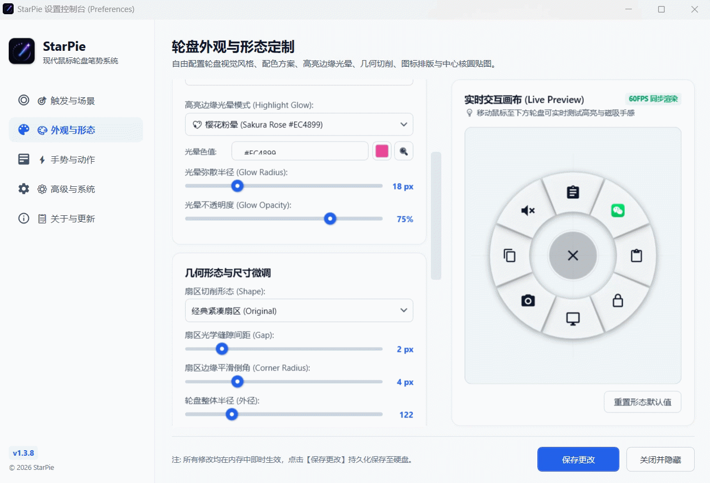
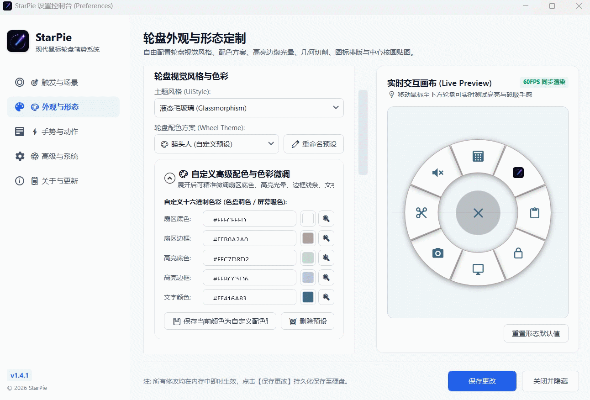
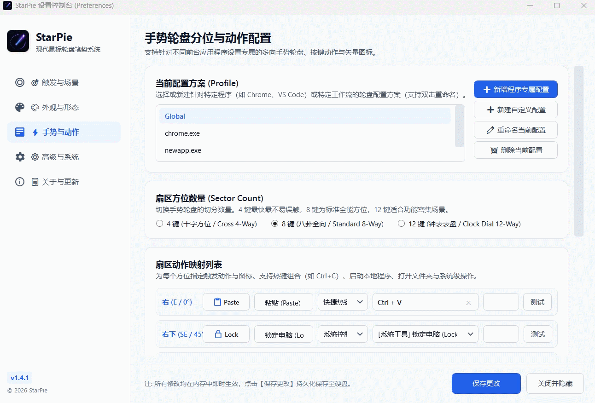
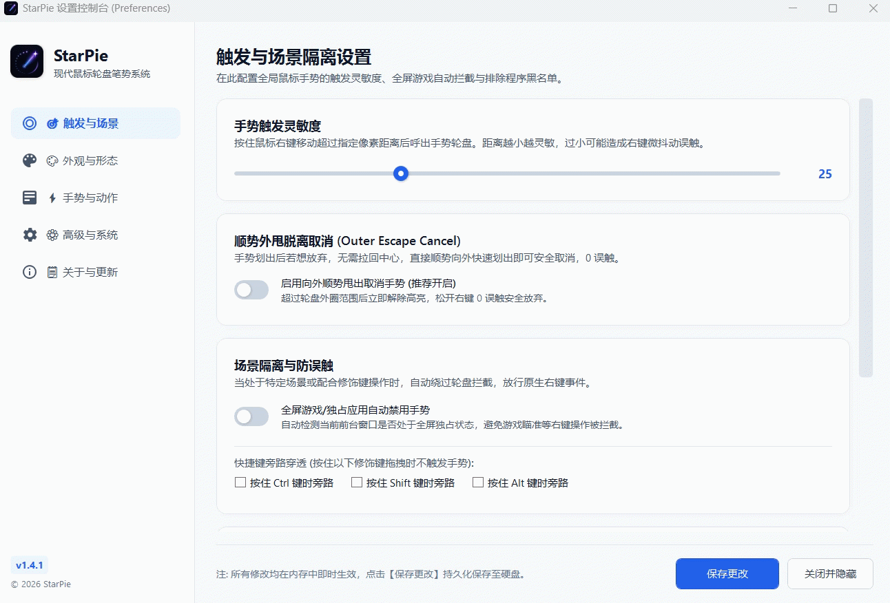

<div align="center">


# StarPie

### Lightweight, Fast & Configurable Radial Pie Menu for Windows 10 / 11

[](https://github.com/SoftBlack42/StarPie/releases)
[-0078D4.svg?style=flat-square&logo=windows)](https://microsoft.com/windows)
[](https://dotnet.microsoft.com/)
[](LICENSE)
[](tests/)
[](#i18n)
[](#acknowledgements)

<br/>

**[简体中文](README.md)** • **[English](README_EN.md)**

<br/>

[🚀 Quick Start](#download) • [✨ Key Features](#features) • [🎨 Visual Customization](#visuals) • [🌐 i18n](#i18n) • [🛠️ Build & Dev](#build) • [💡 Story & Maintenance](#acknowledgements) • [📋 Changelog](CHANGELOG.md)

</div>

---

## <a id="intro"></a>📖 Introduction

**StarPie** is a lightweight, responsive radial mouse gesture tool (Pie Menu) built for Windows 10 and 11.

Hold and drag the right mouse button in any application to summon a fast radial menu right under your cursor. It supports 4 / 8 / 12 sector layouts, per-application profiles, hotkey recordings, quick app launching, and comprehensive visual styling.

> 💡 **Design Highlights**:
> - **Low Memory Footprint**: Native C# WPF application with ~3 to 5 MB background RAM usage;
> - **Low Latency Response**: Built on Win32 `WH_MOUSE_LL` hooks, ensuring fast response without affecting native right-click actions;
> - **Portable & Standalone**: Self-contained single executable available (no external runtime installation required);
> - **Single-Instance Protection**: Global mutex prevents duplicate running instances.

---

## <a id="features"></a>✨ Key Features

### 1. ⚡ Quick Mouse Gesture Summon & Execution
- Hold and drag the right mouse button to summon the radial menu. Release over any sector to trigger its configured action (hotkey, application launch, folder opening, or system action);
- Normal single right-clicks pass through to display default Windows context menus cleanly.

<div align="center">
  
  <br/><br/>
  
</div>

---

### 2. 🚀 Outer Escape Cancel
- To abort an action, you don't need to drag back to the center core;
- Simply flick or overshoot outwards past the wheel boundary. The menu enters a translucent cancel state and releasing the button triggers nothing;
- Configurable toggle switch and adjustable distance threshold slider (140px ~ 320px) provided in settings.

<div align="center">
  
</div>

---

### <a id="visuals"></a>3. 🎨 Multiple Shapes & Theme Presets
- **4 Geometric Shapes**: Original Compact, Floating Circle, Rounded Capsule, and Hexagon Hive;
- **Built-in Presets**: System Auto, Light, Dark, Glassmorphism, Matcha Forest, Glacial Ice, and Morandi Muted;
- Includes an interactive **Live Preview Canvas** on the right side of the preferences window.

<div align="center">
  
  <br/><br/>
  
  <br/><br/>
  
</div>

---

### 4. 🎨 Advanced Color Tuning & Preset Management
- Collapsible fine-tuning panel for sector background, glow, borders, and text colors;
- Supports hex input, color dialog, and screen eyedropper;
- Save, rename, or delete custom color presets anytime.

<div align="center">
  
</div>

---

### 5. 🖼️ Custom Vector & Image Icon Imports
- Import custom **SVG vector files** or **PNG / ICO / JPG** images into your icon library;
- Custom icons are stored locally and can be renamed or deleted easily.

<div align="center">
  
</div>

---

### 6. 🎯 Dynamic 4 / 8 / 12 Sector Layouts
- **4-Sector Layout**: Large cardinal angles, ideal for high-speed blind navigation;
- **8-Sector Layout**: Balanced 8-directional layout (default);
- **12-Sector Layout**: High-density action mapping for complex workflows.

<div align="center">
  
</div>

---

### 7. 💼 Per-App Profiles & Program Picker
- Create dedicated gesture profiles for apps like Chrome, VS Code, Photoshop, or CAD;
- Integrated application scanner scans installed software and filters stale shortcuts;
- Supports creating, copying, deleting, and renaming profiles.

<div align="center">
  
  <br/><br/>
  
</div>

---

### 8. 🛡️ Gaming Isolation, Safety & Multilingual Support
- **Fullscreen & Game Detection**: Automatically bypasses gestures during fullscreen games;
- **Modifier Key Passthrough**: Bypass gestures when holding Ctrl, Shift, or Alt;
- **Blacklist**: Add specific processes to bypass list;
- **Multilingual Support**: Supports Simplified Chinese, Traditional Chinese, English, and Japanese with instant hot switching.

<div align="center">
  
</div>

---

## <a id="download"></a>🚀 Download & Quick Start

### Latest Release: `v1.4.2`

| Package | Recommended For | Description | Download |
| :--- | :--- | :--- | :--- |
| **Standalone Single File (Recommended)** | All Users | Built-in .NET runtime, zero external dependencies | [⬇️ Download StarPie.exe](https://github.com/SoftBlack42/StarPie/releases) |
| **Lightweight Portable Package** | Users with .NET 8 installed | Small archive size, portable | [⬇️ Download Lightweight Zip](https://github.com/SoftBlack42/StarPie/releases) |
| **Historical Releases** | Archival & comparison | Previous release builds and notes | [📂 Releases Archive](https://github.com/SoftBlack42/StarPie/releases) |

### Basic Workflow:
1. Run `StarPie.exe` (it stays active in the system tray);
2. Hold and drag the **right mouse button** anywhere to summon the wheel;
3. Release over a sector to trigger the mapped action;
4. Double-click the tray icon to open the configuration window.

---

## <a id="i18n"></a>🌐 Internationalization (i18n)

Switch interface languages anytime in `Advanced & System`:

| Code | Language | Status |
| :--- | :--- | :---: |
| `zh-CN` | 🇨🇳 Simplified Chinese | 🟢 Supported |
| `zh-TW` | 🇭🇰/🇹🇼 Traditional Chinese | 🟢 Supported |
| `en` | 🇺🇸 English | 🟢 Supported |
| `ja` | 🇯🇵 Japanese | 🟢 Supported |
| `Auto` | 🖥️ System Default | 🟢 Supported |

---

## <a id="build"></a>🛠️ Development & Build

### Requirements
- Windows 10 / 11 (x64)
- [.NET 8.0 SDK](https://dotnet.microsoft.com/download/dotnet/8.0)
- Python 3.10+ (for automated GUI tests only)

### Build & Run
```bash
git clone https://github.com/SoftBlack42/StarPie.git
cd StarPie
dotnet build WinPieGestures/WinPieGestures.csproj -c Release
dotnet run --project WinPieGestures/WinPieGestures.csproj
```

### Automated Tests (18/18 Passed 🟢)
```bash
pip install pytest pywinauto
python -m pytest tests/test_settings.py -v
```

---

## <a id="acknowledgements"></a>💡 Story & Maintenance

### 🌟 Inspiration
As a Mechanical Engineering student frequently using CAD tools like SolidWorks, I appreciated the convenience of mouse gesture radial menus. With the help of AI Agent tools, I wanted to bring this interaction model to the wider Windows desktop environment.

Feedback, bug reports, and pull requests are always welcome!

### 🤖 AI Collaboration
Designed and architected by the developer, with implementation and test automation co-authored with **AI Agent - Antigravity**.

### 📌 Maintenance Note
StarPie v1.4.2 is feature-complete and ready for daily use. Due to academic commitments, updates will follow a phased maintenance schedule.

---

## <a id="license"></a>📄 License

Licensed under the [MIT License](LICENSE).
